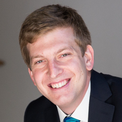

# Bosch Connect World Hackathon 2018

## Contact person

Mathieu Gerard, co-founder and CTO of Mapwize, is on site and ready to answer all your question. You can reach him by email at mathieu [at] mapwize.io.

## Map of the event

The map of the event is available on Mapwize already and can be used freely during the hackathon. If you would like to add anything on that map like beacons or data in the booths or stuff like that, please contact Mathieu.

You can view the map at [http://mwz.io/v/bosch_connected_world_2018](http://mwz.io/v/bosch_connected_world_2018), in the event app, or in the native Mapwize apps on iOS and Android.

## Meraki deployment

A team from Cisco Meraki is participating to the hackathon and a Meraki Wi-Fi infrastructure is deployed. This infrastructure allowes you do do indoor positioning in the hackathon are.

Here is a link to the Meraki hackathon resources: [https://github.com/ObjectIsAdvantag/hackathon-resources](https://github.com/ObjectIsAdvantag/hackathon-resources)

You can find the details on how to integrate Meraki using the IndoorLocation framework here: [https://github.com/IndoorLocation/meraki-indoor-location](https://github.com/IndoorLocation/meraki-indoor-location)

The Meraki configuration is already available for the event map. Please contact Mathieu on site for details.